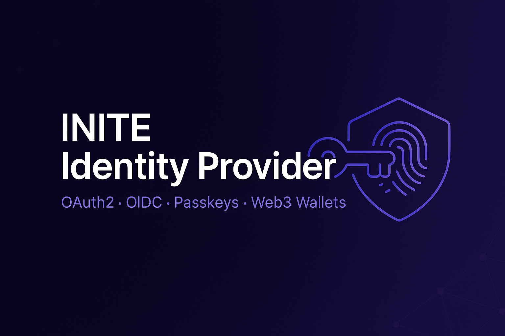

<p align="center">
  <a href="https://github.com/inite-ai/inite-auth-service">
    
  </a>
</p>

<h1 align="center">INITE Identity Provider</h1>

<p align="center">
  <b>Self-hostable OAuth2 / OIDC identity provider — passkeys, magic links, and Web3-native identity.</b><br>
  Standards-deep (PKCE, refresh rotation + theft detection, PAR, DPoP, device flow),<br>
  passwordless-first, and the only one that treats DIDs / verifiable credentials / wallet sign-in as first-class.<br>
  Open-core: the server is AGPL-3.0; the client SDK is MIT.
</p>

<p align="center">
  <a href="https://github.com/inite-ai/inite-auth-service/actions/workflows/ci.yml"></a>
  <a href="LICENSE"></a>
  <a href="https://github.com/inite-ai/inite-auth-service/stargazers"></a>
  <a href="CONTRIBUTING.md"></a>
  
  
</p>

<p align="center">
  <a href="https://auth.inite.ai">Website</a> ·
  <a href="#quick-start">Quick start</a> ·
  <a href="#connect-an-app">Connect an app</a> ·
  <a href="#standards--rfc-coverage">Standards</a> ·
  <a href="#documentation">Docs</a> ·
  <a href="ROADMAP.md">Roadmap</a> ·
  <a href="CONTRIBUTING.md">Contributing</a>
</p>

---

## Why INITE Auth

Most self-hostable IdPs make you choose: the headless-but-bring-your-own-UI camp
(Ory, Keycloak) or the batteries-included-but-SaaS-gated camp (Auth0, WorkOS,
Logto). INITE Auth is a single deployable service that ships the **full OAuth2.1 /
OIDC surface, passkeys, and a working admin + login UI** in one repo, MIT SDK
included — and it's the only one that treats **decentralized identity (DIDs,
verifiable credentials, wallet sign-in) as first-class**, not an afterthought.

- **Standards-deep, not standards-shallow** — PKCE (S256-enforced), refresh-token
  rotation with theft detection, PAR, DPoP, device flow, back-channel logout,
  client-credentials with audience binding. See the [coverage matrix](#standards--rfc-coverage).
- **Passwordless-first** — passkeys/WebAuthn, magic links, email/password with
  exponential-backoff lockout and HIBP breach checks.
- **Web3-native** — every user gets a `did:key`; link Ethereum (SIWE) or TON
  wallets; issue and verify W3C Verifiable Credentials.
- **Multi-tenant** — per-client config, scopes, audience binding, tenant-scoped
  admin and audit log.
- **Operable** — Prometheus metrics, OpenTelemetry traces, health/ready probes,
  durable audit log, Docker-compose self-host.

## Quick start

```bash
git clone https://github.com/inite-ai/inite-auth-service.git
cd inite-auth-service
cp .env.example .env          # fill in secrets (see ENV-SETUP.md)
./start.sh                    # docker compose up + migrations
```

Generate the required secrets:

```bash
echo "POSTGRES_PASSWORD=$(openssl rand -base64 32)"
echo "REDIS_PASSWORD=$(openssl rand -base64 32)"
echo "JWT_SECRET=$(openssl rand -base64 64)"
echo "REFRESH_TOKEN_HMAC_SECRET=$(openssl rand -base64 64)"
```

Verify:

```bash
curl http://localhost:3002/health
curl http://localhost:3002/.well-known/openid-configuration
```

Full walkthrough: [QUICK-START.md](QUICK-START.md). Production (RS256/JWKS, reverse
proxy): [ENV-SETUP.md](ENV-SETUP.md).

## Connect an app

1. **Register an OAuth client** (edit `scripts/register-client.example.ts` for your
   app, then `npm run register-client`).
2. **Send users through the authorization-code + PKCE flow:**

```
GET https://auth.example.com/v1/oauth/authorize
  ?response_type=code&client_id=my-app
  &redirect_uri=https://my-app.example.com/callback
  &scope=openid%20profile%20email&state=xyz
  &code_challenge=<S256>&code_challenge_method=S256
```

3. **Exchange the code for tokens** at `POST /v1/oauth/token`
   (`grant_type=authorization_code`, with the `code_verifier`).

PKCE is mandatory and only `S256` is accepted. Full client example (React +
token refresh): [INTEGRATION-GUIDE.md](INTEGRATION-GUIDE.md). Or use the SDK:

```ts
import { IniteAuth } from '@inite/auth-sdk'; // MIT — packages/sdk
const auth = new IniteAuth({ baseUrl: 'https://auth.example.com', clientId: 'my-app' });
```

## Standards & RFC coverage

| Capability | Standard | Status |
| --- | --- | --- |
| Authorization Code + PKCE (S256 enforced) | RFC 6749 / 7636 | ✅ |
| Refresh-token rotation + reuse/theft detection | RFC 6749 / 6819 | ✅ |
| Client credentials (M2M) + audience binding | RFC 6749 | ✅ |
| Device Authorization Grant | RFC 8628 | ✅ |
| Pushed Authorization Requests (PAR) | RFC 9126 | ✅ |
| DPoP (sender-constrained tokens) | RFC 9449 | ✅ |
| Token Revocation / Introspection | RFC 7009 / 7662 | ✅ |
| OIDC Discovery + JWKS (RS256) | OIDC Core / RFC 7517 | ✅ |
| Back-channel & front-channel logout | OIDC | ✅ |
| Loopback redirect for native apps | RFC 8252 | ✅ |
| Passkeys / WebAuthn (+ backup codes) | W3C WebAuthn L2 | ✅ |
| TOTP 2FA | RFC 6238 | ✅ |
| Sign-In With Ethereum | EIP-4361 | ✅ |
| DIDs + Verifiable Credentials | W3C DID / VC | ✅ |
| Step-up authentication enforcement | OIDC / RFC 9470 | ✅ |
| Token Exchange | RFC 8693 | ✅ |
| Resource Indicators | RFC 8707 | ✅ |
| MCP bundle (AS metadata + DCR + PRM) | RFC 8414 / 7591 / 9728 | ✅ |
| private_key_jwt client authentication | RFC 7523 / 7521 | ✅ |
| Signed request objects (JAR) | RFC 9101 | ✅ |
| Signing-key rotation (overlapping kids) | OIDC Core | ✅ |
| Organizations / Teams + relational RBAC | — | ✅ |
| CAEP / Shared Signals (SET transmitter) | RFC 8417 / 8935 / 8936 | ✅ |
| Social login federation (Google/GitHub/OIDC) | OIDC | ✅ |
| Rich Authorization Requests | RFC 9396 | ✅ *(flag: `RAR_ENABLED`)* |
| mTLS + certificate-bound tokens | RFC 8705 | ✅ *(flag: `MTLS_ENABLED`)* |
| SCIM 2.0 inbound provisioning | RFC 7643 / 7644 | ✅ *(flag: `SCIM_ENABLED`)* |
| SAML 2.0 SP | — | ⬜ roadmap |

Full gap analysis vs Ory / Keycloak / Zitadel / Auth0 / WorkOS / Logto and the
path to feature-parity is in **[ROADMAP.md](ROADMAP.md)**.

## Architecture

```
my-app-one.example.com   my-app-two.example.com   my-app-three.example.com
          └────────────────────────┼────────────────────────┘
                                   ▼
                         auth.example.com  (this service)
                                   │
              ┌────────────────────┼────────────────────┐
              ▼                    ▼                     ▼
         PostgreSQL              Redis                 SMTP
       (users, clients,   (sessions, lockout,     (magic links,
        tokens, audit)     rate limits)            notifications)
```

## Stack

- **Runtime:** Node.js 22, [NestJS](https://nestjs.com) 11
- **Data:** PostgreSQL + [Prisma](https://www.prisma.io); Redis (sessions, rate limits, lockout)
- **Auth:** Passport.js, [SimpleWebAuthn](https://simplewebauthn.dev) (passkeys), `jose` (RS256 JWKS), `ethers` (SIWE)
- **Frontend:** Next.js admin UI + docs site (`frontend/`)
- **SDK:** TypeScript + React (`packages/sdk/`, MIT)
- **Tooling:** Jest, ESLint (flat config + size/complexity gates), Prettier, Docker

## Documentation

- [QUICK-START.md](QUICK-START.md) — run it locally in minutes
- [ENV-SETUP.md](ENV-SETUP.md) — full environment / secrets reference
- [INTEGRATION-GUIDE.md](INTEGRATION-GUIDE.md) — client integration (PKCE, SDK, embed)
- [ADMIN-SETUP.md](ADMIN-SETUP.md) — admin panel & operations
- [SECURITY.md](SECURITY.md) — security model, threat model & disclosure
- [ROADMAP.md](ROADMAP.md) — what's next, toward SOTA parity
- [docs/NEXT-SESSION.md](docs/NEXT-SESSION.md) — tactical, executable next-session plan
- [CHANGELOG.md](CHANGELOG.md) — release history

### API reference (OpenAPI / Swagger)

The full HTTP surface is documented as an OpenAPI 3 spec, generated from the
running server:

- **Interactive docs (Swagger UI):** [`/docs`](http://localhost:3002/docs)
- **Raw spec:** [`/openapi.json`](http://localhost:3002/openapi.json) — feed it
  to client codegen or contract tests.

Outside production the spec is also written to `openapi.json` at the repo root on
boot (gitignored) so tooling can pick it up without a running instance.

### Key endpoints

OAuth2/OIDC: `/.well-known/openid-configuration`, `/.well-known/jwks.json`,
`/v1/oauth/{authorize,token,userinfo,revoke,introspect,par,device_authorization,logout}`.
Auth: `/v1/auth/{passkey,email,password}/*`. OTP: `/v1/auth/otp/{request,verify}`
+ `/v1/auth/otp/mfa/{request,verify}` (email/SMS code login + step-up). Social
login: `/v1/auth/oauth/:provider/{start,callback}`
(Google, GitHub, generic OIDC). Identity: `/v1/auth/identity/*`
(DID, wallets, credentials, 2FA, export/delete). Sessions: `/v1/session/*`.
Admin: `/v1/admin/*` (incl. `/v1/admin/audit-log/export?format=csv|json`).

## Contributing

PRs welcome — see [CONTRIBUTING.md](CONTRIBUTING.md) for the bars (tests, append-only
migrations, no secrets, conventional titles) and the CLA. Be kind: [CODE_OF_CONDUCT.md](CODE_OF_CONDUCT.md).

```bash
npm ci && npm run build && npm test && npm run lint
```

## Roadmap

Tracked in [ROADMAP.md](ROADMAP.md). Next up: SAML 2.0 SP and more SDKs.
Recently shipped: SCIM 2.0 inbound provisioning (RFC 7643/7644, behind
`SCIM_ENABLED`), mTLS + certificate-bound tokens (RFC 8705, behind
`MTLS_ENABLED`), Rich Authorization Requests (RFC 9396, behind `RAR_ENABLED`),
private_key_jwt (RFC 7523) + signed request objects (RFC 9101), CAEP / Shared
Signals (RFC 8417), organizations + relational RBAC, signing-key rotation with
overlapping kids, encrypted 2FA secrets at rest, Token Exchange (RFC 8693), and
the MCP bundle (RFC 8414 / 7591 / 9728 / 8707).

## License

[AGPL-3.0-or-later](LICENSE) for the server, with a commercial license also
available — see [LICENSING.md](LICENSING.md). The client SDK in
[`packages/sdk/`](packages/sdk/) is MIT. Contributions require a CLA; see
[CONTRIBUTING.md](CONTRIBUTING.md).

## Support

- Issues & discussions: https://github.com/inite-ai/inite-auth-service/issues
- Commercial licensing / security reports: mike@inite.ai
